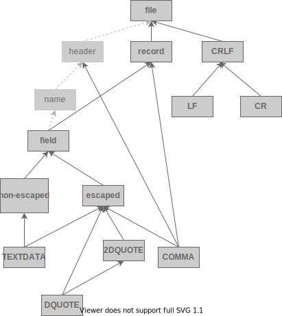
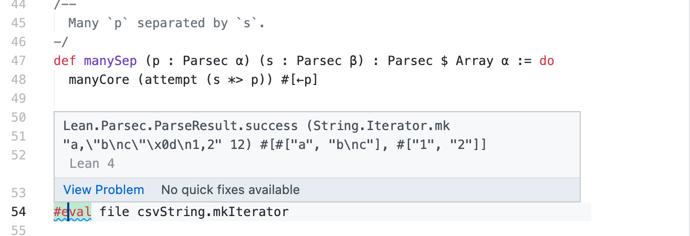

## CSV Parser Sample

The CSV parser may be the simplest but practical parser in the world. In this sample, we will try to
write one with the Lean programming language.

For simplicity, we will stick to the [RFC 4180](https://datatracker.ietf.org/doc/html/rfc4180)
format, without any extensions, which has the ABNF grammar of:

```abnf
file        = [header CRLF] record *(CRLF record) [CRLF]
header      = name *(COMMA name)
record      = field *(COMMA field)
name        = field
field       = (escaped / non-escaped)
escaped     = DQUOTE *(TEXTDATA / COMMA / CR / LF / 2DQUOTE) DQUOTE
non-escaped = *TEXTDATA
COMMA       = %x2C
CR          = %x0D
DQUOTE      = %x22
LF          = %x0A
CRLF        = CR LF
TEXTDATA    = %x20-21 / %x23-2B / %x2D-7E
```

And we will use this hand crafted CSV string:

```lean
def csvString : String := "a,\"b\nc\"\r\n1,2"
-- which is (without escape) actually
-- a,"b\nc"\r\n1,2
-- and should be parsed into
-- [["a", "b\nc"], ["1", "2"]]
```

## Parser in Functional Programming

When it comes to parsing in functional programming, people often adopt a pattern called "parser
combinator". The idea is first invented in Haskell, and today even many imperative languages have
implemented it, e.g. [nom](https://github.com/Geal/nom) for Rust and
[scala-parser-combinators](https://github.com/scala/scala-parser-combinators) for Scala.

Lean also has a parser combinator implemented in its core, called `Parsec` (The Lean one is named
after that in Haskell, but they are a bit different. We will talk about that later).

The `Parsec` is defined in `Lean.Data.Parsec`. To use it you should add the following lines on top
of your file:

```lean
import Lean.Data.Parsec

open Lean Parsec
```

## Data Structure to Keep the Parsing Result

Before writing the parsing code, it's helpful to forget about the syntax and think about what the
parsed data should look like.

We all know that CSV files carry a sequence of records, and each record consists of several fields.
(CSV may also have an optional header, and the header is also a type of record). Also, each line
should have the same number of fields.

So our definition for CSV may look like this:

```lean
abbrev Field := String
abbrev Record := Array Field
abbrev Csv := Array Record
```

## Let's Start Parsing

Unlike imperative parsers, a functional parser is made up of small parsers combined into larger ones
using parser combinators.  The overall structure of these CSV parsers follows the structure of ABNF:



### The Basic Parsers

At the bottom of the diagram are the basic parsers. Let's implement them one by one.

The `DQUOTE` double quote can be defined as:

```lean
def dQUOTE : Parsec Char := pchar '"'
```

The `pchar` can be thought of as the abbreviation of "parser char". It takes a `Char` and tries to
match that `Char` in the `String`.

In the same way, `COMMA`, `LF`, `CR` can be represented as:

```lean
def comma : Parsec Char := pchar ','
def cr : Parsec Char := pchar '\r'
def lf : Parsec Char := pchar '\n'
```

`TEXTDATA` is a bit more complex. Instead of `pchar` we use `satisfy` which takes a function of type
`Char -> Bool`, so we can parse any `Char`s that satisfy the given function.

```lean
def textData : Parsec Char := satisfy fun c =>
  0x20 ≤ c.val ∧ c.val ≤ 0x21 ∨
  0x23 ≤ c.val ∧ c.val ≤ 0x2B ∨
  0x2D ≤ c.val ∧ c.val ≤ 0x7E
```

Here we are using some nice mathematical Greek letters for our `and` (`∧`) and `or` (`∨`)
expressions which you can do in Lean.

### The Combinator

After creating the "bottom" level parsers, we can combine them into larger ones.

The most simplest one is `2DQUOTE`:

```lean
def twoDQuote : Parsec Char := attempt (pchar '"' *> pchar '"')
```

The `*>` operator is used to sequence two parsers. The first parser's result is ignored, and the
sequenced parsers return the second result.

The `attempt` is used because we want the two `Parsec` to match as a whole. The string iterator will
be reset to before `attempt` if any parser in the bracket fails (e.g. The first `pchar`).

Then the `escaped` string:

```lean
def escaped : Parsec String :=
  dQUOTE *>
  manyChars (textData <|> COMMA <|> CR <|> LF <|> «twoDQuote»)
  <* dQUOTE
```

The `<*` operator is similar to `*>` but the left is kept while the right one is ignored. In this
way both bounding `dQUOTEs` are discarded, and the contents is returned.

The `<|>` operator is used for alternatives. Once the first parsec fails, it will try the second
one, then the third, ...

`non-escaped`:

```lean
def nonEscaped : Parsec String := manyChars textData
```

`manyChars` takes a `Parsec Char` and matches zero or more instances of that parser and merges them
into a `String`.

```lean
def field : Parsec Field := escaped <|> nonEscaped
```

There are many combinators in the Lean core, and you can look at them in the [documentation](https://leanprover-community.github.io/mathlib4_docs/Lean/Data/Parsec.html#Lean.Parsec.pchar).

### A More Complex Parsec

The `record` in CSV is defined as:

```
record = field *(COMMA field)
```

So a `record` consists of zero or more `field`s separated by `comma`.

You might want to write the parser like this:

```lean
def record : Parsec Record := manySep field comma
```

But actually there is no `manySep` function provided by Lean, so we need to write it. Fortunately,
there is a similar one we have used, the `manyChars`. There are several `many*` combinators in `Parsec`:

```lean
@[inline]
partial def manyCharsCore (p : Parsec Char) (acc : String) : Parsec String :=
  (do manyCharsCore p (acc.push $ ←p))
  <|> pure acc

@[inline]
def manyChars (p : Parsec Char) : Parsec String := manyCharsCore p ""

@[inline]
def many1Chars (p : Parsec Char) : Parsec String := do manyCharsCore p (←p).toString

@[inline]
partial def manyCore (p : Parsec α) (acc : Array α) : Parsec $ Array α :=
  (do manyCore p (acc.push $ ←p))
  <|> pure acc

@[inline]
def many (p : Parsec α) : Parsec $ Array α := manyCore p #[]

@[inline]
def many1 (p : Parsec α) : Parsec $ Array α := do manyCore p #[←p]
```

Looking at how `manyChars` is implemented. It invokes a recursive function `manyCharsCore` and gives
an initial accumulator `String` of `""` Then the `manyCharsCore` iteratively matches the `p` parsec
and return the accumulator when it fails. The `many` combinator also works in the same way.

So we can follows this pattern and write our own:

```lean
def manySep (p : Parsec α) (s : Parsec β) : Parsec $ Array α := do
  manyCore (attempt (s *> p)) #[←p]
```

The `manySep` is very similar to that of `many1`, except that it requires a prefix separator `s`
before each `p` match except for the first one.

The `file` works in a similar way except that we use `crlf` as the separator.

```lean
def file : Parsec $ Array Record :=
  manySep record (crlf <* notFollowedBy eof) <* (optional crlf) <* eof
```

The `notFollowedBy`, `optional` and `eof` is used to handle the optional new line at the end of the
CSV file.

### Parse it!

Everything is done now. Let's parse a CSV file. You can now use the parser we wrote to parse the
`csvString`. A `Parsec` takes a `String.Iterator` and returns the `ParseResult`.

```lean
#eval file csvString.mkIterator
```

If you are in VSCode you can move your cursor onto the `#eval` and you can see the result.



The `ParseResult` return value is not very easy to cope with, so we can use a wrapper to lift it
into an `Except`.

```lean
def parse (s : String) : Except String $ Array $ Array $ String :=
  match file s.mkIterator with
  | Parsec.ParseResult.success _ res => Except.ok res
  | Parsec.ParseResult.error it err  => Except.error s!"offset {it.i.repr}: {err}"

#eval parse csvString

-- Except.ok #[#["a", "b\nc"], #["1", "2"]]
```

## Some Extra Tricks

### Code Structure

To keep the code clear, the best practice is to split the data structure part and the parsing part
into two modules, respectively `Basic.lean` and `Parser.lean`.

So the file structure may look like:

```sh
.
├── CSVParser.lean
├── CSVParser
│   ├── Basic.lean
│   ├── Parser.lean
│   └── Printer.lean
```

You can also have a separate `Printer` module if you have a complex serialization logic.

It's also recommended to group all functions in a separate namespace, namely `namespace CSVParser`.

### User State

If you have some experience of writing parsers in Haskell, you will notice that in Lean `Parsec` we
cannot have a user state, but that's by design. We should use the `StateT` transformer to encode the
state.

```lean
abbrev StateParsec σ := StateT σ Parsec
```

And current `Parsec` function are automatically lifted from `Parsec` to `StateParsec`, so you can use them as usual.

*NOTE:* this is why we used `abbrev` command, otherwise you will have to implement `MonadLift` yourself.

### Challenge: How to parse CSV homogeneously?

The parser we write above can parse heterogenous CSV files (records may be a different length),
which your may not want.

```lean
def csvString' : String := "a,\"b\nc\"\r\n1,2\r\n4,5,6"

#eval parse csvString'
-- Except.ok #[#["a", "b\nc"], #["1", "2"], #["4", "5", "6"]]
```

Notice that the 3rd record has 3 items while the first two records only have 2. So how can you
enforce that the records are all the same length?

The answer to the question is provided in [Main.lean](./Main.lean), but you might learn a lot
if you think about it yourself.

*HINT:* Also similar to the `many*` series of combinators.

### Next Steps: How to use `Parsec` on `Stream`?

Streaming is a very important feature for the web or any application that wants to process data with
minimal memory overhead. Protobuf, GIF, PNG, ..., all these formats are designed to support
streaming, and you may need a way to parse forward only streams in Lean. However, this is left as an exercise for the reader.

Please feel free to propose a pull request on this sample or discuss it further on the
[Lean4 Zulip Channel](https://leanprover.zulipchat.com/#narrow/stream/270676-lean4).

## Other Resources for `Parsec`

You can also look at the example of parsing XML ([`Lean.Data.Xml`](https://github.com/leanprover/lean4/tree/master/src/Lean/Data/Xml)) and JSON ([`Lean.Data.Json`](https://github.com/leanprover/lean4/tree/master/src/Lean/Data/Json)) in Lean core.

The GitHub code search for [Parsec](https://github.com/leanprover/lean4/search?q=Parsec) is also useful.