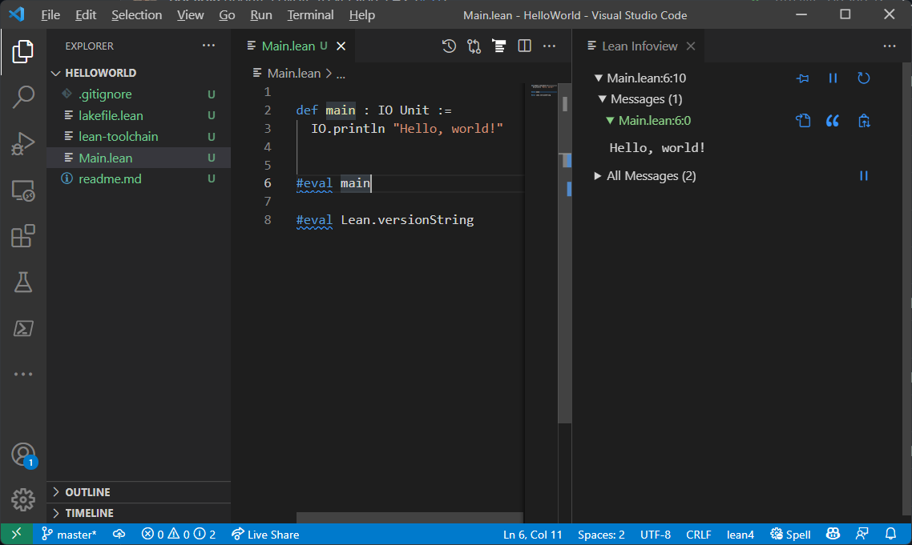

## Hello World Sample

If all goes well you will see the following in your Visual Studio
Code window when you put the cursor at the end of the `#eval main`
statement.



This is the simplest possible program you can create that runs.
To build an executable that you can run from your Terminal run the
following commands from your VS Code Terminal window:

```
lake build
"./build/bin/HelloWorld.exe"
```

And you will see the console output `Hello, world!`.

While Lean is designed for mathematicians and for writing proofs, it is still a general-purpose
programming language.  Let's take a closer look at the code:

```lean
def main : IO Unit :=
  IO.println "Hello, world!"
```

This should be easy to read for most programmers, `def` defines a function named `main` which in
this case takes no input parameters.  After the colon (`:`) is the return type, in this case `IO
Unit` then the function implementation follows the `:=` symbol.  The implementation contains one
statement which is a function call to the `IO.println` function passing one string argument
`Hello, world!`. Notice, you can pass an argument to a function without using any parentheses.

The sample then uses a special command to the Lean interpreter `#eval` which evaluates that function
in place, and in this evaluation, we pass no arguments because the main function we just defined has
none.

To understand what this more deeply let’s look at how the `println` function is defined:

```lean
def println [ToString α] (s : α) : IO Unit := …
```

The `[ToString α] (s : α)` part of this definition means println has 2 parameters, the first one in
square brackets is a `context` parameter, meaning `println` could need to use some `ToString` type
inferencing to convert its input parameter to a `string` type.  This one we’ll explain in more detail
later.

### Parameters

The second argument `(s : α)` is a traditional parameter definition.  Here it defines a parameter
named `s` of type `α`.  What is `α` you ask?  I'm glad you asked :-) There’s a special shorthand in
Lean that single letter type names like `α` are `inferred` to mean any `Type`.  So, to complete this
picture Lean also has `implicit` arguments that you don’t need to pass and this `α` name is an
example of that.  You can actually be explicit about it and define `α` as an implicit argument using
curly braces as follows:

```lean
def println {α : Type} [ToString α] (s : α) : IO Unit :=
```

Type with a capital T is the base type of everything in Lean. Actually the type system in Lean is
a bit more complicated than that, with a concept of `type universes` but we’ll get to that later.

The important thing for you to see right now is that in Lean you can write variable `s` is of type
`x` using a colon, like this `s : x` which is similar to how typescript does it.

### Return Type

You might be asking what does the return type `IO Unit` mean exactly?  Well, the `Unit` part is
pretty easy, it is kind of like the `void` type in other languages, namely, the `main` function
doesn't return anything.  The `IO` is connected to the fact that we call `IO.println`:

```lean
abbrev IO : Type → Type := EIO Error
```

Here you see the concept of "abbreviations" which is a kind of "alias" and here it has a type and,
after the `:=` symbol, the implementation which calls the `EIO` function passing something called
`Error`.

The type of `IO` here is interesting, it says `Type → Type`.  The arrow here means `function type`,
IO is a function that transforms some input Type to some output Type.  Wow, so you can see now that
Lean is a Functional programming language because you can reason about functions, and manipulate
functions and their types like they are objects. This is similar to how delegates or lambas are
first class objects in C#, Python and Javascript, but here it is even more deeply integrated into
the type system.

What is `Error`, well turns out `Error` is like a fancy `enum` that lists all the types of
exceptions that can be raised in the system. So what is `EIO`?  Well, it is the following one line
function:

```lean
def EIO (ε : Type) : Type → Type := EStateM ε IO.RealWorld
```

We see more Greek letters, epsilon (`ε`).  Lean encourages the use of Greek letters, especially when
they have a mathematical meaning.  `EIO` takes one parameter named epsilon (ε) of type `Type`.  Notice
the type of EIO is the function type `Type → Type` meaning EIO returns a function, which matches the
definition of `IO` we saw earlier. The implementation calls a function named `EStateM` passing our
epsilon parameter and another object named `IO.RealWorld`.  Let’s take a look at `IO.RealWorld` first
because it’s kind of interesting:

```lean
def IO.RealWorld : Type := Unit
```

Hmmm, so it too is a function that takes no parameters and returns a Type, and the implementation is
the void-like type `Unit`, meaning it returns a Type that kind of represents nothing.  Notice this
function is operating on Types, not object, yet it is treating types like objects.  This is the magic
of Lean where Types themselves are first class objects.  This allows this `IO.RealWorld` function to
be used in the declaration of a Type, namely the type of our `println` function earlier.

`IO.RealWorld` is actually a mechanism that tells the Lean type system it is something that has a
`side effect` of playing with the real world (outside of the scope of the Lean environment), but
doesn’t specify how.  The strong typing of any type system has to stop somewhere, and RealWorld is
one of those boundaries.

`EStateM` is:

```lean
def EStateM (ε σ α : Type u) := σ → Result ε σ α
```

And `Result` is an inductive Type definition:
```lean
inductive Result (ε σ α : Type u) where
  | ok    : α → σ → Result ε σ α
  | error : ε → σ → Result ε σ α
```

This inductive Type definition takes 3 parameters of type `Type u`, (notice you can collapse
multiple parameters of the same type into the compact form `( ε σ α : Type u)`.

Inductive types are a core building block in Lean.  Normally in an object-oriented language you
might define a new custom type using a "class" or a "struct", but in lean you can define a new type
using the keyword `inductive`.  This type has 2 different constructors `ok` and `error`.  These
constructors build a `Result` object from the given parameters, `ε σ α`.  Specifically, `ok`
constructor uses `α` and `σ` and the `error` constructor uses `ε` and `σ`.

The function type `Result ε σ α` needs some explanation.  This is not a recursive call to the
inductive type, this is simply telling Lean to build an object of type `Result` by packing away the
3 parameters `ε σ α`. Notice this type doesn’t tell Lean how to `store` these parameters.  Lean
automatically stores them and provides a built-in way to extract those parameters later if you need
them.  The interesting thing to note is that if the `Result` is an `ok` result you will only be able
to extract `α` and `σ` whereas if it is an `error` result you will only be able to extract the
error information in `ε` and `σ`.

Now we can go back and fully understand the `println` return type `IO Unit`.  This is actually a
function call!!  Yes, you can define a return type by calling a function, so long as that function
operates on `Type` and returns a `Type`.  This is hugely powerful concept; you can now build an
incredibly rich type system made up of functions. So, we call `IO` with the type `Unit`.  `IO` is
just an abbreviation for `EIO Error` so we are really calling `EIO Error Unit`, and EIO expands to
`EStateM ε IO.RealWorld` so we are effectively calling `EStateM Error IO.RealWorld Unit` and
remember `EStateM` is simply constructing the inductive type `Result` with 3 parameters, which we
now know are `Error`, `IO.RealWorld` and `Unit`. Phew!  What all this means is that `IO.println`
returns a `Result` object, and depending on what happens this result object might contain an `ok`
result of  `IO.RealWorld` and `Unit` or it might contain an `error` with `Error` and `IO.RealWorld`.
So both cases can have a side effect on the real world.  This is exactly right, the side effect in
this case is output to the console window where you see the following message is printed: 1Hello,
world!1.

Functional Programming Languages generally don’t like unexplained side effects.  The RealWorld
abstraction is a way for Lean to deal with this kind of side effect, explaining to the compiler
that it is `ok` for println to have a side effect on the IO output stream.

You can now dive even deeper and look at the implementation of `println` which you can do from
Visual Studio Code by simply placing your cursor inside this `println` and press F12 to
Goto Definition.  This kind of exploration can be very useful in leaning the language.

### Type Inferencing

So back to the `ToString` type inferencing.  Well Lean provides a concept
called `Type Class` which is a special type of class that can participate
in type inferencing.  `ToString` is such a type:

```
class ToString (α : Type u) where
  toString : α → String
```

This says `ToString` type class takes one parameter of any `Type`
(and from any type univers `u`) and it provides a `method` called
`toString`.  This method is actually just a property but because
the property has the function type `α → String` it is actually a
method that you can call passing any object `` of any type
and you get back a String.  Yep, that sounds like a ToString to me!

Lean builds up a library of code that looks like this:
```
instance : ToString Nat :=
  ⟨fun n => Nat.repr n⟩
```

These are `instances` of the type class ToString, bound to specific
types - this one is the instance for converting natural numbers (`Nat`)
to strings.  The implementation of this instance is using another built
in function named `Nat.repr` which is defined to return the string
representation of `n`.

This instances allows you to then do this:

```lean
#eval toString 5     -- "5"
```

And you get back the string representation of the natural number 5.

Type inferencing is not a closed system.  Your programs can add to the
library of ToString instances so that your programs can build on it.

Read more about [Type Classes](https://leanprover.github.io/theorem_proving_in_lean4/type_classes.html).

## Lambdas

The syntax we just saw `⟨fun n => Nat.repr n⟩` is also very interesting.
Inside the funky brackets `⟨...⟩` is a lambda, an inline function
definition.  The `fun` keyword defines an anonymous function that
in this case takes a parameter `n` and returns the result of the
function call `Nat.repr n`.  Notice no types are definition for the
parameter `n` or for the return type.  You can add this type information
if you want, but in most cases Lean is clever enough to `infer` what
the types are from the context.

You can test this out in your VS Code instance:

```lean
#eval (fun n => Nat.repr n) 5
```
and

```lean
#eval (fun (n : Nat) => Nat.repr n) 5
```

The funky brackets `⟨...⟩` is a shorthand for find me a constructor on the required type `ToString`
that takes a single string argument, and it finds `ToString.mk`, so it is equivalent to writing:

```lean
ToString.mk (fun n => Nat.repr n)
```

This is calling the ToString constructor named `mk`
because we have to return something that matches the type
`ToString Nat`.

Read [more about functions](https://leanprover.github.io/theorem_proving_in_lean4/dependent_type_theory.html#function-abstraction-and-evaluation).