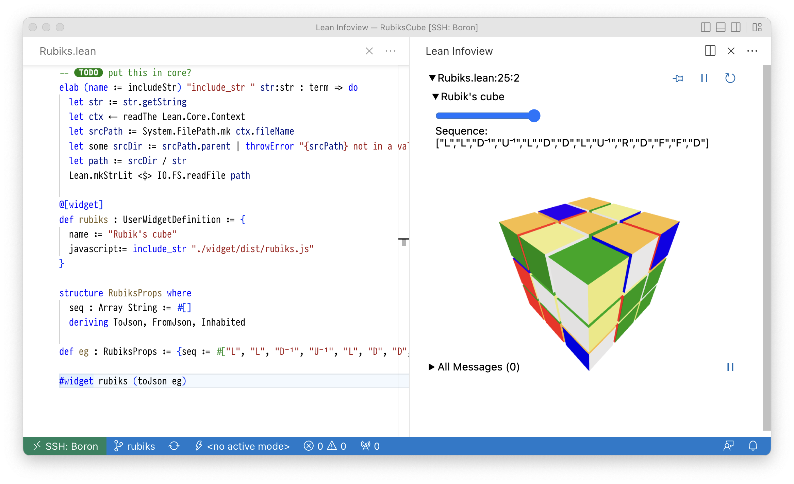

# Rubik's cube visualiser

This project is a demo of the user widgets system. It displays a Rubik's cube in the Lean infoview.
Inspired by the [rubiks-cube-group](https://github.com/kendfrey/rubiks-cube-group) from Kendal Frey.

The purpose of this example is to show how to build widgets using TypeScript and bundled NPM libraries.

## Running

In order to build you need [Lean 4](https://leanprover.github.io/lean4/doc/quickstart.html)
and [Node.js](https://nodejs.org/en/). You also need to be using VSCode (or a Gitpod). First run

```shell
lake build rubiksJs
```

and then open `Rubiks.lean` in the editor. Put your cursor over the `#widget` command and you should
see an interactive Rubik's cube in the infoview.
